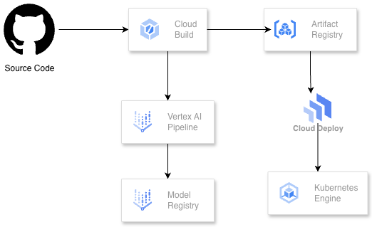

# MLOps Pipeline with Vertex AI and Cloud Deploy

> **45 min hands-on lab** | Beginner-Intermediate

Build an automated MLOps pipeline that trains an ML model with Vertex AI, containerizes it, and deploys through staging → production on GKE using Cloud Deploy.



## What You'll Build

- Vertex AI training pipeline
- Containerized ML model serving
- Cloud Deploy delivery pipeline with staging/production namespaces
- Automated deployments via Cloud Build

## Prerequisites

- GCP account with billing enabled
- Basic Python, Docker, and Kubernetes knowledge
- Google Cloud SDK installed (or use Cloud Shell)
- Python 3.9-3.12
- 

---

## Setup (5 min)

### 1. Set Environment Variables

```bash
export PROJECT_ID=$(gcloud config get-value project)
export REGION="us-central1"
export BUCKET_NAME="${PROJECT_ID}-mlops-lab"

# Clone and enter repo
git clone https://github.com/misskecupbung/mlops-vertex-ai-cloud-deploy.git
cd mlops-vertex-ai-cloud-deploy
```

### 2. Run Setup Script

```bash
chmod +x scripts/setup.sh
./scripts/setup.sh
```

This enables APIs, creates a GCS bucket, Artifact Registry, and a GKE cluster with staging/production namespaces.

---

## Module 1: ML Training Code (10 min)

We're building an **Iris flower classifier** using scikit-learn.

### 1.1 Review the Code

- `src/train.py` - loads data, trains RandomForest, saves to GCS
- `src/serve.py` - FastAPI server for predictions

### 1.2 Build Containers

```bash
# Training image
gcloud builds submit --config=cloudbuild-training.yaml

# Serving image
gcloud builds submit --config=cloudbuild-serving.yaml
```

---

## Module 2: Vertex AI Pipeline (10 min)

Vertex AI Pipelines orchestrates ML workflows in a serverless manner.

### 2.1 Review Pipeline

See `src/pipeline.py` for the pipeline stages:
1. `data_preparation` - load/split data
2. `model_training` - train RandomForest
3. `model_evaluation` - compute metrics
4. `model_upload` - register to Model Registry

### 2.2 Compile and Submit

```bash
# Setup Python env
python3 -m venv venv
source venv/bin/activate
pip install -r requirements.txt

# Compile
python src/compile_pipeline.py

# Submit
python src/submit_pipeline.py
```

### 2.3 Monitor

Go to [Vertex AI Pipelines Console](https://console.cloud.google.com/vertex-ai/pipelines) and watch the pipeline run (~5 min).

---

## Module 3: Cloud Deploy (10 min)

Cloud Deploy manages progressive delivery to staging → production.

### 3.1 Review Configs

- `clouddeploy.yaml` - pipeline and targets
- `k8s-manifests/` - deployment, service, HPA

### 3.2 Create Pipeline

```bash
export PROJECT_NUMBER=$(gcloud projects describe ${PROJECT_ID} --format='value(projectNumber)')
envsubst < clouddeploy.yaml > clouddeploy-rendered.yaml
gcloud deploy apply --file=clouddeploy-rendered.yaml --region=${REGION}
```

### 3.3 Prepare Namespaces

**Run this before creating a release:**

```bash
chmod +x scripts/prepare-namespaces.sh
./scripts/prepare-namespaces.sh
```

This creates ConfigMaps and ServiceAccounts with correct values.

Verify:
```bash
kubectl get configmap model-config -n staging -o jsonpath='{.data.model_uri}'
# Should show: gs://YOUR-PROJECT-ID-mlops-lab/models/iris-classifier
```

### 3.4 Create Release

```bash
gcloud deploy releases create release-001 \
  --project=${PROJECT_ID} \
  --region=${REGION} \
  --delivery-pipeline=mlops-model-pipeline \
  --images=serving-image=${REGION}-docker.pkg.dev/${PROJECT_ID}/mlops-lab/serving:v1
```

---

## Module 4: Deploy & Test (8 min)

### 4.1 Monitor Staging

```bash
gcloud deploy releases describe release-001 \
  --delivery-pipeline=mlops-model-pipeline --region=${REGION}

gcloud deploy rollouts list \
  --delivery-pipeline=mlops-model-pipeline --release=release-001 --region=${REGION}
```

### 4.2 Verify Staging Pods

```bash
gcloud container clusters get-credentials mlops-cluster --region=${REGION}
kubectl get pods -n staging

# Check logs if needed
kubectl logs -l app=model-serving -n staging
```

### 4.3 Test Staging

```bash
STAGING_IP=$(kubectl get svc model-serving -n staging -o jsonpath='{.status.loadBalancer.ingress[0].ip}')

curl -X POST http://${STAGING_IP}:8080/predict \
  -H "Content-Type: application/json" \
  -d '{"features": [5.1, 3.5, 1.4, 0.2]}'
```

Expected:
```json
{"prediction": "setosa", "confidence": 0.95, "model_version": "v1"}
```

### 4.4 Promote to Production

```bash
gcloud deploy releases promote \
  --release=release-001 \
  --delivery-pipeline=mlops-model-pipeline \
  --region=${REGION}
```

Production requires approval. If prompted:
```bash
gcloud deploy rollouts approve release-001-to-production-0001 \
  --delivery-pipeline=mlops-model-pipeline \
  --release=release-001 --region=${REGION}
```

### 4.5 Test Production

```bash
kubectl get pods -n production

PROD_IP=$(kubectl get svc model-serving -n production -o jsonpath='{.status.loadBalancer.ingress[0].ip}')

curl -X POST http://${PROD_IP}:8080/predict \
  -H "Content-Type: application/json" \
  -d '{"features": [6.7, 3.0, 5.2, 2.3]}'
```

### 4.6 View in Console

Go to [Cloud Deploy Console](https://console.cloud.google.com/deploy) → `mlops-model-pipeline` to see the release progression.

---

## Bonus: CI/CD with Cloud Build

Set up a trigger to automate the full workflow on git push:

```bash
gcloud builds triggers create github \
  --repo-name=your-repo \
  --repo-owner=your-github-username \
  --branch-pattern="^main$" \
  --build-config=cloudbuild.yaml
```

Every push to `main` will build containers, run the pipeline, and deploy to staging.

---

## Cleanup

```bash
chmod +x scripts/cleanup.sh
./scripts/cleanup.sh
```

Deletes: GKE cluster, Cloud Deploy resources, Artifact Registry, GCS bucket.

---

## Resources

- [Vertex AI Docs](https://cloud.google.com/vertex-ai/docs)
- [Cloud Deploy Docs](https://cloud.google.com/deploy/docs)
- [MLOps Architecture](https://cloud.google.com/architecture/mlops-continuous-delivery-and-automation-pipelines-in-machine-learning)

---

## Troubleshooting

### Pods 0/1 Ready - "No model found"

ConfigMap is missing or wrong:

```bash
kubectl create configmap model-config \
  --from-literal=model_uri=gs://${PROJECT_ID}-mlops-lab/models/iris-classifier \
  -n staging --dry-run=client -o yaml | kubectl apply -f -

kubectl rollout restart deployment model-serving -n staging
```

### GCS Permission Denied (403)

Workload Identity not configured:

```bash
# Create and configure service account
gcloud iam service-accounts create model-serving-gsa --display-name="Model Serving SA" 2>/dev/null || true

gcloud projects add-iam-policy-binding ${PROJECT_ID} \
  --member="serviceAccount:model-serving-gsa@${PROJECT_ID}.iam.gserviceaccount.com" \
  --role="roles/storage.objectViewer" --quiet

gcloud iam service-accounts add-iam-policy-binding \
  model-serving-gsa@${PROJECT_ID}.iam.gserviceaccount.com \
  --role="roles/iam.workloadIdentityUser" \
  --member="serviceAccount:${PROJECT_ID}.svc.id.goog[staging/model-serving-sa]" --quiet

kubectl annotate serviceaccount model-serving-sa -n staging \
  iam.gke.io/gcp-service-account=model-serving-gsa@${PROJECT_ID}.iam.gserviceaccount.com --overwrite

kubectl rollout restart deployment model-serving -n staging
```

### Pipeline Fails at model_training

GCS timing issue. Re-run:

```bash
python src/compile_pipeline.py
python src/submit_pipeline.py
```

### Cloud Shell Session Expired

```bash
gcloud auth login
export PROJECT_ID=$(gcloud config get-value project)
export REGION=us-central1
gcloud config set project ${PROJECT_ID}
gcloud auth application-default login
gcloud container clusters get-credentials mlops-cluster --region=${REGION}
```

### LoadBalancer IP Pending

Wait a few minutes for GCP to provision:

```bash
kubectl get svc model-serving -n staging -w
```